# 📘 Git TP — Introduction to Version Control

  

> Mini-project for the **Software Engineering** module (UM6P-CC): hands-on practice with Git locally, branching, merging, a GitHub remote, and paired collaborative work.

---

## 🎯 Objectives

- Learn how to use **Version Control Software**
- Master versioning of a software projet
- Share a projet and work as a team


## 📝 Project description

The **`tpgit`** repository simulates a versioned shopping list: text files (`fruits.txt`, `vegetables.txt`, `sauces.txt`, `herbs.txt`) are built up commit by commit, across several branches, before being published on GitHub and shared with a partner in the cloned repository **`tp-git-binome`**.

## 👥 Authors

| Name | Email | Role |
|---|---|---|
| Mouhamadou Taha Thiam | `Mouhamadou.THIAM@um6p.ma` | Pair 2 | 
| Mohamed Idriss Nana | `Mohamed.NANA@um6p.ma` | Pair 1 |

## ⚙️ Initial setup

```bash
git config --global user.name  "Taha Thiam"
git config --global user.email "Mouhamadou.THIAM@um6p.ma"

git init
git status / git add / git commit / git log
```

## 🌿 Branches & history

| Branch | File | Commits (chronological) |
|---|---|---|
| `master` | `fruits.txt` | apple → mango → ananas → poire |
| `vegetable` | `vegetables.txt` | carotte → betterave → navet |
| `sauces` | `sauces.txt` | mayonnaise → ketchup |

```bash
git branch                              # check current branch
git log --graph --oneline --decorate --all
gitk --all                              # visual history
```

<details>
<summary>📸 Show screenshots — commit history</summary>

| | |
|---|---|
| 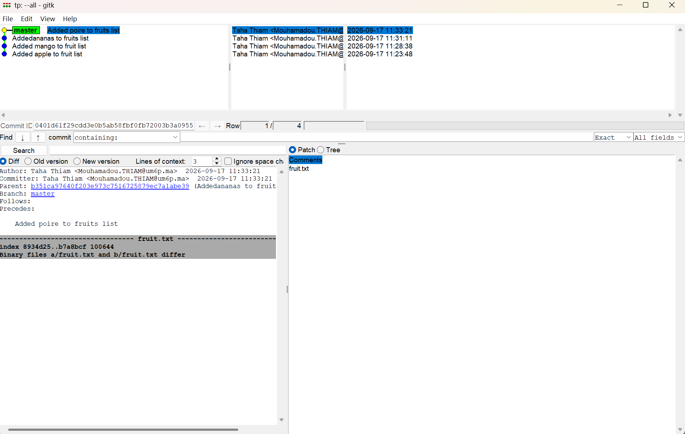 `gitk` — `master` history on `fruits.txt` | 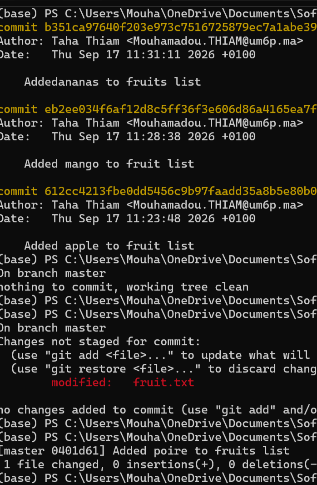 Terminal — `git log` / `git commit` on `fruits.txt` |
| 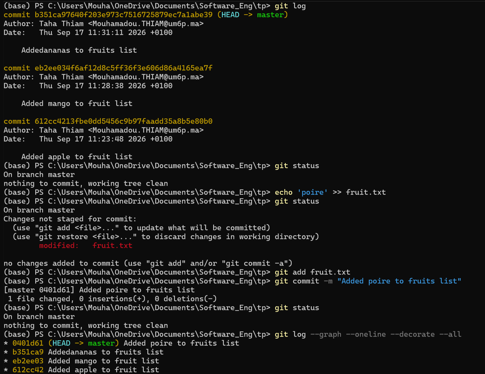 `git log` — `vegetable` branch on `vegetables.txt` | 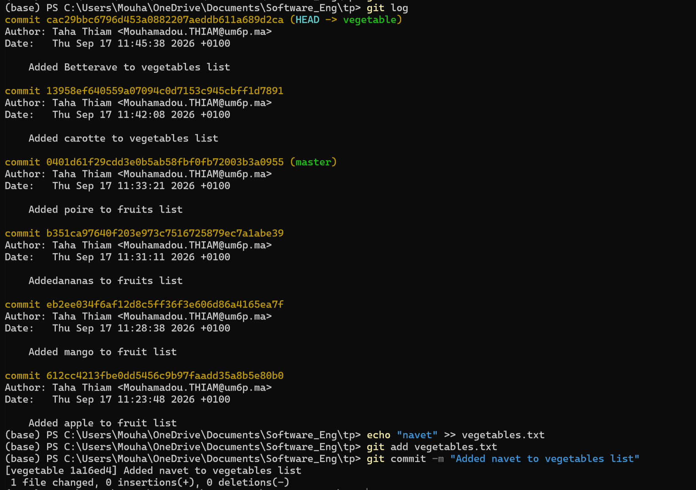 `git log` — `vegetable` branch graph |
| 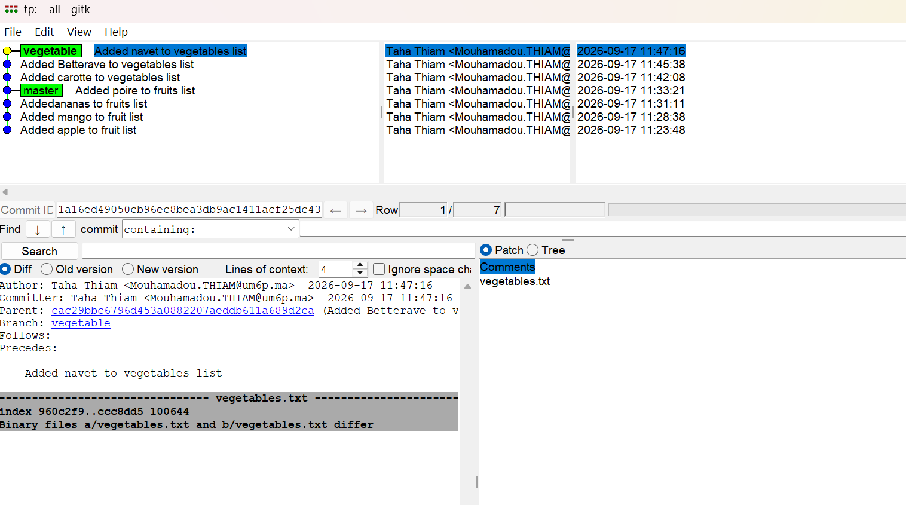 `gitk` — `vegetables` branch, forked from `master` | |

</details>

## 🔀 Merges

```bash
git checkout master
git merge vegetable
git merge sauces
```

The `vegetable` and `sauces` branches were merged into `master` without conflicts; the combined history is verified with `git log --graph --all`.

<details>
<summary>📸 Show screenshot — merge result</summary>

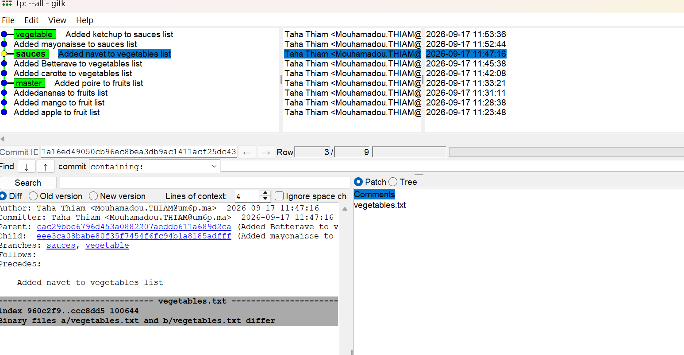
*`master` already contains the branch tips → "Already up to date."*

</details>

## ☁️ Remote repository & collaborative work

```bash
git remote add origin https://github.com/GojoTech-461/Tpgit.git
git remote -v
git push -u origin master

# On the partner's side
git clone https://github.com/momo226-code/tpgit-.git tp-git-binome
```

Each pair pushed their changes (`git push`) then pulled their partner's (`git pull`), taking turns in the pusher/puller roles.

<details>
<summary>📸 Show screenshots — clone & collaborative commits</summary>

| | |
|---|---|
| 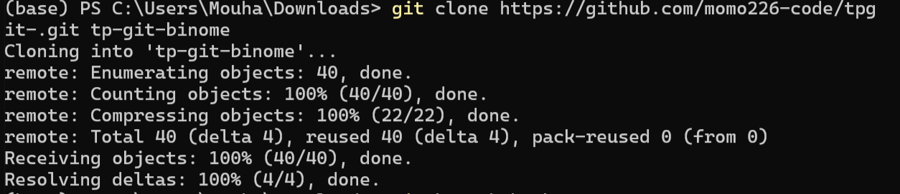 `git clone` — cloning `tpgit` into `tp-git-binome` | |

</details>

## ⚔️ Conflict resolution

Two conflicts were deliberately triggered (same lines edited differently on each side) and then resolved:

| File | Cause | Resolution |
|---|---|---|
| `fruits.txt` | Concurrent additions (Fraise/Papaye vs. apple/orange/lemon/grenadille) | Manual merge → `git add` → `git commit` → `git push` |
| `vegetables.txt` | Concurrent edits (roles reversed) | `git merge --abort` tested, then a clean resolution → `git push` |

```bash
git pull                # triggers the conflict
# manually edit the conflicted file
git add fruits.txt
git commit -m "Resolve conflict"
git push
```

<details>
<summary>📸 Show screenshots — conflict & resolution</summary>

| | |
|---|---|
| 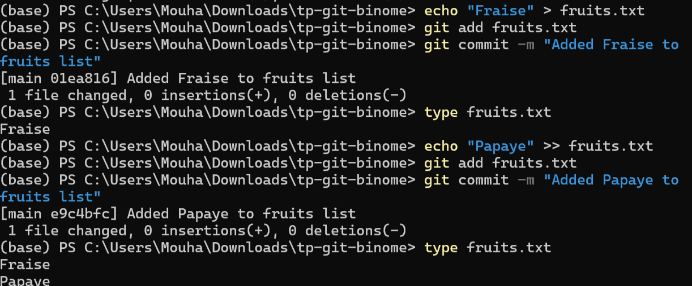 `git pull` → `CONFLICT (content): Merge conflict in fruits.txt` | 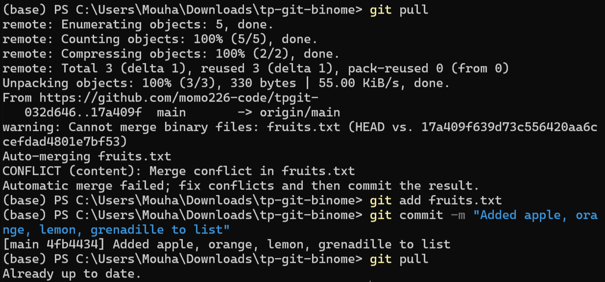 Conflict resolved and pushed: `Added apple, orange, lemon, grenadille to list` |
| 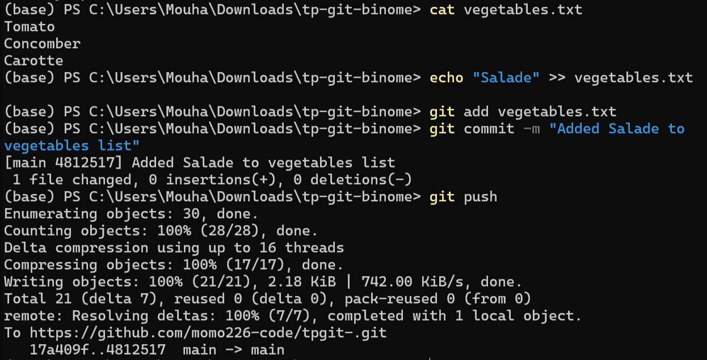 `vegetables.txt` synced and pushed after resolution (`Added Salade to vegetables list`) | |

</details>

## 🌱 Independent branch (no conflict) — `herbs`

Following the pairing exercise, a second branch (`herbs`) was created, committed to independently and merged back cleanly, with no conflict this time.

```bash
git checkout -b herbs
echo "Basil"  > herbs.txt && git add herbs.txt && git commit -m "Added Basil to the herbs list"
echo "Chives" > herbs.txt && git add herbs.txt && git commit -m "Added Chives to the herbs list"

git checkout main
git merge herbs
git pull
git push
```

<details>
<summary>📸 Show screenshots — herbs branch</summary>

| | |
|---|---|
| 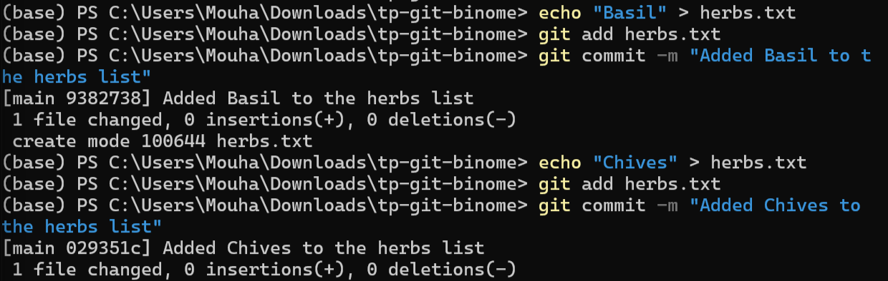 Commits on the `herbs` branch (`Basil`, `Chives`) | 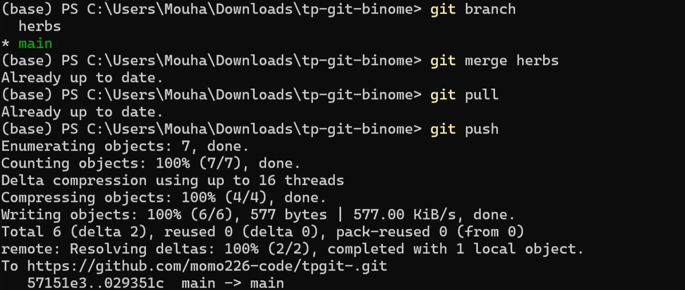 `git merge herbs` → already in sync → `git push` |

</details>

## 📊 Final commit graph

```bash
gitk --all
```

<details>
<summary>📸 Show screenshots — synchronized repository</summary>

| | |
|---|---|
| 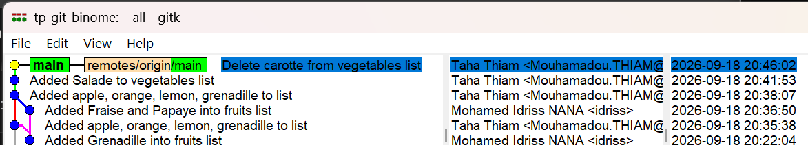 `tp-git-binome` — `main` in sync with `remotes/origin/main` | 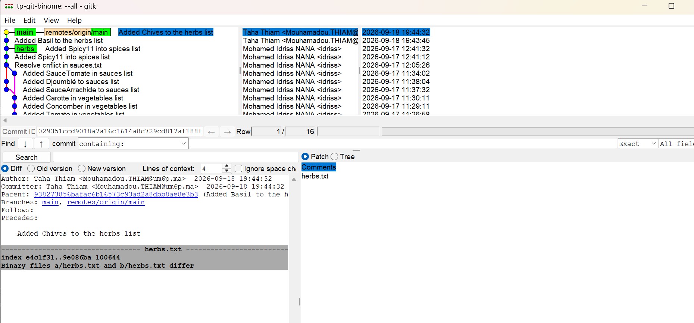 Full graph: `herbs`, conflict resolution on `sauces.txt`, and both contributors' commits |

</details>

## 🧠 Skills acquired

- The `add → commit → push/pull` cycle
- Creating, switching and merging branches (`git branch`, `git checkout`, `git merge`)
- Reading history (`git log`, `gitk`)
- Remote collaboration and Git conflict resolution

## 📚 Resources

[Git Magic](https://crypto.stanford.edu/~blynn/gitmagic/intl/fr/book.pdf) · [Learn Git Branching](https://learngitbranching.js.org/) · [Try Git](https://try.github.io/) · [Pro Git Book](https://git-scm.com/book/en/v2)

---

📄 *Git TP report — UM6P, September 2026*
